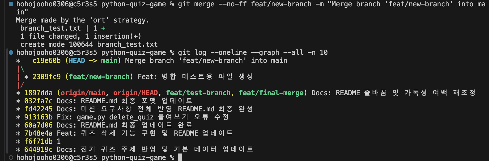

# ⚡ 전기 상식 퀴즈 게임 - Python CLI

> 터미널 환경에서 즐기는 파이썬 기반 객체지향 전기 상식 퀴즈 게임입니다.  
> **OOP, JSON 영속성, Atomic Write, 입력 검증, 예외 처리**를 반영한 콘솔 프로젝트입니다.

---

## 목차

- [1. 프로젝트 개요](#1-프로젝트-개요)
- [2. 주제 선정 이유](#2-주제-선정-이유)
- [3. 개발 환경](#3-개발-환경)
- [4. 주요 기능](#4-주요-기능)
- [5. 모듈 호출 흐름](#5-모듈-호출-흐름)
- [6. 실행 방법](#6-실행-방법)
- [7. 클래스 및 구조 설계](#7-클래스-및-구조-설계)
- [8. 데이터 파일 명세](#8-데이터-파일-명세)
- [9. 파일 저장 정책](#9-파일-저장-정책)
- [10. 대량 데이터 확장성 분석](#10-대량-데이터-확장성-분석)
- [11. Git 규칙 및 실행 증빙](#11-git-규칙-및-실행-증빙)
- [12. 새로운 환경에서 설치 및 실행](#12-새로운-환경에서-설치-및-실행)

---

## 1. 프로젝트 개요

**전기 상식 퀴즈 게임**은 객체지향 프로그래밍과 JSON 파일 입출력을 활용하여 만든 콘솔 기반 퀴즈 프로그램입니다.

사용자는 터미널에서 전기 및 회로 기초 지식과 관련된 문제를 풀 수 있으며, 직접 퀴즈를 추가하거나 삭제할 수 있습니다.

---

## 2. 주제 선정 이유

전기와 회로 기초 지식은 일상생활뿐 아니라 공학 및 과학 학습에서도 중요한 기본 개념입니다.

따라서 사용자가 재미있게 전기 상식을 복습하고 자신의 이해도를 점검할 수 있도록 **전기 상식 퀴즈**를 주제로 선정했습니다.

---

## 3. 개발 환경

### OS 정보

```text
ProductName:      macOS
ProductVersion:   15.7.4
BuildVersion:     24G517
```

### 쉘 & 터미널

```bash
echo $SHELL
/bin/zsh
```

- macOS 기본 터미널 사용
- zsh 쉘 환경

### Docker & Python 개발 환경

```bash
docker --version
Docker version 28.5.2, build ecc6942
```

- OrbStack 환경에서 Docker 실행
- Python 3.10 이상
- 외부 라이브러리 없이 Python 표준 라이브러리만 사용

---

## 4. 주요 기능

| 기능 | 설명 |
|---|---|
| 📝 퀴즈 풀기 | 저장된 전기 퀴즈를 풀고 100점 만점 기준 점수 산출 |
| 📌 퀴즈 추가 | 사용자가 문제, 4개 선택지, 정답 번호를 직접 등록 |
| 📋 퀴즈 목록 조회 | 현재 저장된 전체 퀴즈 문제 목록 확인 |
| 🏆 최고 점수 확인 | 역대 최고 점수 기록 유지 및 조회 |
| 🗑️ 퀴즈 삭제 | 목록에서 삭제할 퀴즈 번호를 선택하여 삭제 |
| 💾 데이터 영속성 | 프로그램 종료 후에도 `state.json`에 데이터 저장 |
| 🛡️ 예외 처리 | 잘못된 입력, `Ctrl+C`, `EOFError` 상황 처리 |
| 🔄 Atomic Write | 임시 파일 저장 후 `os.replace()`로 안전하게 교체 |

---

## 5. 모듈 호출 흐름

```text
User / CLI Input
       │
       ▼
    main.py  ──────── 메뉴 선택 및 입력 검증 ────────► input_helper.py
       │
       ├── 1. play_quiz()
       │        └──► Quiz.is_correct()
       │        └──► score_calculator
       │
       ├── 2. add_quiz()
       │        └──► Quiz 객체 생성
       │        └──► QuizGame.quizzes.append()
       │
       ├── 3. show_quizzes()
       │        └──► QuizGame.quizzes 조회
       │
       ├── 4. show_score()
       │        └──► QuizGame.best_score 조회
       │
       └── 5. delete_quiz()
                └──► QuizGame.delete_quiz()
                         │
                         ▼
                    QuizGame.save_data()
                         │
                         ▼
                  state.json.tmp
                         │
                         ▼
                    os.replace()
                         │
                         ▼
                     state.json
```
> 💡 **모듈 호출 흐름 및 데이터 처리 핵심 요약**
> 
> 1. **입력 검증 (`input_helper.py`)**  
>    사용자 입력을 `main.py`에서 받으면 먼저 `input_helper`를 거쳐 잘못된 형식이나 범위 밖의 입력값을 사전에 검증합니다.
> 
> 2. **객체 연산 (`Quiz` & `QuizGame`)**  
>    메뉴 선택에 따라 퀴즈 풀기(`play_quiz`), 추가(`add_quiz`), 삭제(`delete_quiz`) 등의 로직을 수행하고, `Quiz` 객체 단위로 정답 확인 및 리스트를 관리합니다.
> 
> 3. **원자적 저장 (`Atomic Write`)**  
>    퀴즈 추가/삭제 등으로 데이터 변경 발생 시 `QuizGame.save_data()`가 실행됩니다. 원본 파일 손상을 막기 위해 임시 파일(`state.json.tmp`)에 먼저 저장한 후, `os.replace()`를 통해 `state.json`으로 안전하게 교체합니다.
---

## 7. 클래스 및 구조 설계

## OOP 적용 이유

### 1. 캡슐화 및 상태 관리

`Quiz` 클래스는 문제, 선택지, 정답 데이터를 하나의 객체로 묶어 관리합니다.

또한 `is_correct()` 메서드를 통해 정답 검증을 객체 내부에서 처리하므로 데이터와 기능이 자연스럽게 연결됩니다.

### 2. 유지보수성 및 확장성

단순한 `dict`나 `tuple` 구조로 관리할 경우 데이터 구조가 바뀔 때 여러 함수를 함께 수정해야 합니다.

하지만 클래스를 사용하면 객체의 인터페이스를 유지하는 방식으로 기존 코드 수정 범위를 줄일 수 있습니다.

---

## 주요 클래스 및 모듈

| 클래스 / 모듈 | 주요 메서드 | 역할 |
|---|---|---|
| `Quiz` | `display(i)`, `is_correct(ans)`, `to_dict()` | 개별 문제 출력, 정답 비교, JSON 변환 |
| `QuizGame` | `load_data()`, `save_data()`, `delete_quiz(idx)` | 퀴즈 데이터 관리, 파일 입출력, 최고 점수 관리 |
| `main.py` | `print_menu()`, `main()` | CLI 실행 흐름 제어 |
| `input_helper.py` | `get_valid_int()` | 숫자 입력 검증 및 범위 확인 |

---

## 9. 파일 저장 정책

## Atomic Write 적용

파일 저장 시 기존 `state.json`에 직접 덮어쓰지 않습니다.

대신 임시 파일인 `state.json.tmp`에 먼저 저장한 뒤, `os.replace()`를 사용하여 원본 파일을 교체합니다.

```text
1. state.json.tmp 파일에 데이터 저장
2. 저장이 성공하면 os.replace() 실행
3. state.json.tmp → state.json 교체
```

이 방식을 통해 저장 중 프로그램이 종료되더라도 기존 파일 손상을 방지할 수 있습니다.

---

## 예외 처리 정책

| 상황 | 처리 방식 |
|---|---|
| 잘못된 숫자 입력 | 재입력 요청 |
| 범위를 벗어난 입력 | 안내 메시지 출력 후 재입력 |
| `Ctrl+C` 종료 | 안전하게 데이터 저장 후 종료 |
| `EOFError` 발생 | 자동 저장 후 종료 |
| `PermissionError` | 권한 오류 안내 메시지 출력 |
| `JSONDecodeError` | 손상 파일 백업 후 기본 데이터로 초기화 |

---

## 손상 파일 복구 정책

`state.json` 파일을 읽는 중 JSON 파싱 오류가 발생하면 기존 파일을 백업합니다.

```text
state.json → state.json.bak
```

이후 기본 퀴즈 5개 데이터로 자동 초기화하여 프로그램이 계속 실행될 수 있도록 합니다.

---

## 10. 대량 데이터 확장성 분석

현재 구조는 하나의 `state.json` 파일을 전체 로딩하는 방식입니다.

퀴즈 개수가 1,000개 이상으로 증가할 경우 다음과 같은 한계가 발생할 수 있습니다.

| 문제점 | 설명 |
|---|---|
| I/O 병목 | 퀴즈 1개 추가/삭제 시 전체 JSON 파일을 다시 저장해야 함 |
| 검색 속도 제한 | 리스트 순회 기반으로 시간 복잡도 `O(N)` 발생 |
| 메모리 사용 증가 | 모든 데이터를 한 번에 메모리에 로딩 |

---

## 개선 방안

### 1. SQLite DB 전환

SQLite를 사용하면 필요한 데이터만 조회할 수 있고, 인덱스를 활용하여 검색 성능을 개선할 수 있습니다.

```text
검색 성능: O(N) → O(log N)
```

### 2. JSON Lines 포맷 적용

`jsonl` 포맷을 사용하면 각 퀴즈 객체를 한 줄 단위로 저장할 수 있습니다.

```json
{"question": "문제1", "choices": ["A", "B", "C", "D"], "answer": 1}
{"question": "문제2", "choices": ["A", "B", "C", "D"], "answer": 3}
```

Append-Only 방식으로 데이터를 추가할 수 있어 파일 전체를 다시 쓰는 비용을 줄일 수 있습니다.

---

## 11. Git 규칙 및 실행 증빙

## Commit Convention

커밋 메시지는 다음 형식을 따릅니다.

```text
타입: 작업 내용 요약
```

### 예시

```text
Feat: main.py 입력 검증 헬퍼 함수 분리
Fix: game.py delete_quiz 들여쓰기 오류 수정
Docs: README.md 실행 증빙 스크린샷 및 명세 보완
```

---

## 실행 증빙 스크린샷

스크린샷은 프로젝트 내 `docs/screenshots/` 경로에 수록되어 있습니다.

| 항목 | 설명 |
|---|---|
| 프로그램 실행 증빙 | 메뉴, 퀴즈 풀기, 추가, 삭제, 종료 |
| Git Commit Log 증빙 | 10회 이상 커밋 및 병합 커밋 |
| Git Clone / Pull 증빙 | 저장소 복제 및 최신 코드 반영 실습 |



```

---

## 12. 새로운 환경에서 설치 및 실행


```bash
git clone https://github.com/juhoo03/python-quiz-game.git
cd python-quiz-game
```

## 프로그램 실행

```bash
python3 main.py
```

---

## 프로젝트 핵심 요약

> 이 프로젝트는 전기 기초 상식을 퀴즈 형식으로 학습할 수 있는 Python CLI 프로그램입니다.  
> 객체지향 설계, JSON 파일 저장, Atomic Write, 입력 검증, 예외 처리, 데이터 복구 정책을 적용하여 안정성과 확장성을 고려했습니다.

---
